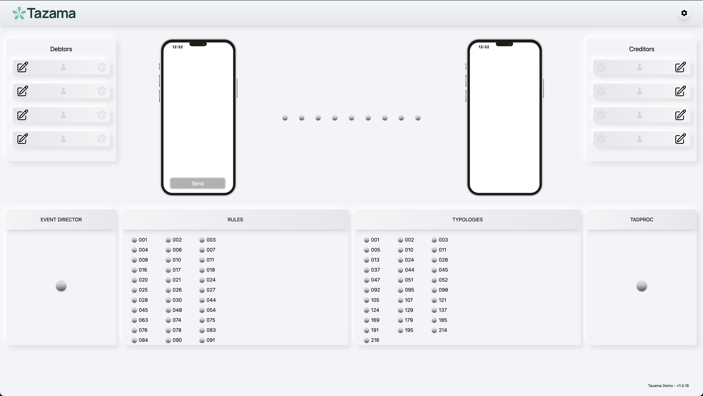
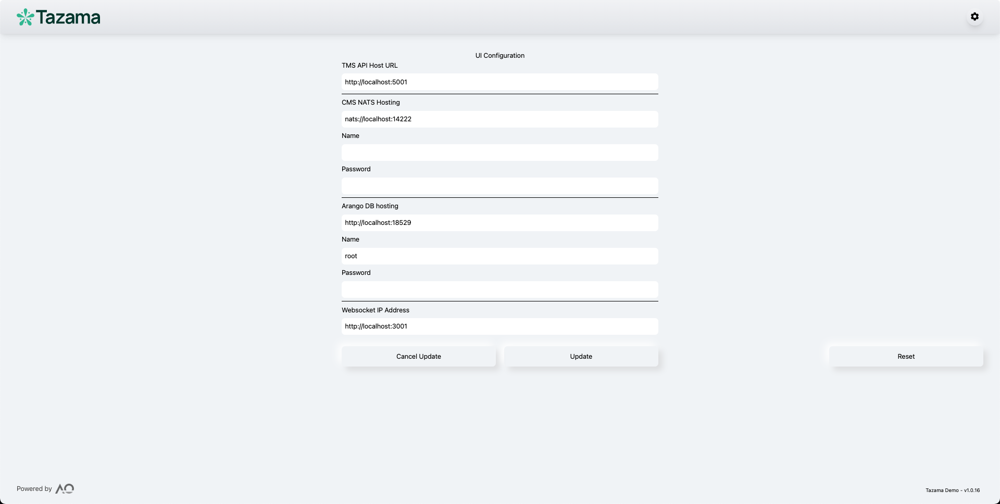

ar
 </br>

# Tazama Demo Application</br>
>
> [!NOTE]
> **[`Tazama`](https://tazama.org/index.html)** Open Source Real-Time Transaction Monitoring Software for Fraud and Money Laundering Detection

![GitHub License][github-license-badge] </br>
![typescript][typescript]

>
Welcome to the Tazama Demo Application. This demo app is used to demo the Tazama Open Source Real-Time Transaction Monitoring System built to support any Financial Services Provider (FSP) that requires Transaction Monitoring for Fraud and Money Laundering detection. Whether that FSP is a small provider running one or 2 transactions per day or a national payment switch running at over 3,000 Transactions per second. With Tazama they can implement simple or complex rules, implement Fraud Detection controls or support Anti-Money Laundering activities. 🌍

## Requirements

In this demo:

-  **[Full-Stack-Tazama-Docker](https://github.com/tazama-lf/Full-Stack-Docker-Tazama)** - Setup the Rules and Typologies Using Docker Compose from the Tazama Repository. Follow the instructions in the readme.md
- 💻 **[Demo UI](#)** - Use the easy to setup UI to demo the Tazama Open Source Real-Time Transaction Monitoring System that dynamically builds the UI based on the configured rules and typologies

## Table of Contents

- [Tazama Demo Application](#tazama-demo-application)
  - [Requirements](#requirements)
  - [Table of Contents](#table-of-contents)
  - [Getting Started](#getting-started)
    - [Setup UI](#setup-ui)
    - [Defaults will load from the .env file](#defaults-will-load-from-the-env-file)
  - [Troubleshooting](#troubleshooting)
  - [License](#license)
  - [Contributors](#contributors)

## Getting Started

To get started by running the demo locally and NOT in the docker container, follow these steps:

1. Fork & clone repository:

```bash
## Don't forget to ⭐ star and fork it first :)
git clone git@github.com:tazama-lf/tazama-demo.git
```

2. Setup

```bash
add your GH_TOKEN to the .npmrc file ${GH_TOKEN}
```

3. Install the dependencies:

```bash
yarn install --frozen-lockfile
```

4. Create a new .env file and copy the contents of the `env_sample` file to the newly created .env

5. Run the development server:

```bash
yarn dev
```

6. Open [http://localhost:3001](http://localhost:3001) with your browser to see the result.

### Setup UI

1. First Load

>  <br/>

2. Click the gear icon on the top right for Settings

> <br/>

### Defaults will load from the .env file

- TMS API Host URL: `http://localhost:5000` **Check what port number is being used by the TMS server on the docker instance **(Default Port: 5000)***
- CMS NATS Hosting: `http://localhost:14222` if run outside of docker-compose else `nats://nats:4222` **Check what port number is being used by the NATS server on the docker instance **(Default Port: 4222)***
- Arango DB Hosting: `http://localhost:18529` **Check what port number is being used by the TMS server on the docker instance **(Default Port: 8529)***
- Websocket IP Address: `http://localhost:3001` **If run if run outside of docker-compose else `http://{your_ip_address}:3001` **(Default Port: 3001)***

## Troubleshooting

TBC...

## License

This project is licensed under the Apache License Version 2.0. For more information, see the [LICENSE](./LICENSE) file.

## Contributors

<!-- prettier-ignore-start -->
<!-- markdownlint-disable -->
<table>
  <tbody>
    <tr>
      <td align="center" valign="top" width="14.28%"><a href="https://github.com/KamikaziD"><br /><sub><b>Detmar Ruhfus</b></sub></a><br />💻 📖</td>
      <td align="center" valign="top" width="14.28%"><a href="https://github.com/sahra-amir"><br /><sub><b>Sahra Amir</b></sub></a><br />💻</td>
      <td align="center" valign="top" width="14.28%"><a href="https://github.com/Oliver-AO-GH"><br /><sub><b>Oliver Vermeulen</b></sub></a><br />💻</td>
    </tr>
  </tbody>
  <tfoot>
    <tr>
      <td align="center" size="13px" colspan="7">
        
          <a href="https://all-contributors.js.org/docs/en/bot/usage">Add your contributions</a>
        </img>
      </td>
    </tr>
  </tfoot>
</table>

<!-- markdownlint-restore -->
<!-- prettier-ignore-end -->

<!-- ALL-CONTRIBUTORS-LIST:END -->

<!-- Badges and links -->

[typescript]: https://img.shields.io/badge/TypeScript-007ACC?style=for-the-badge&logo=typescript&logoColor=white
[github-license-badge]: https://img.shields.io/github/license/tazama-lf/tazama-demo?link=https%3A%2F%2Fgithub.com%2FBlazity%2Fnext-enterprise%2Fblob%2Fmain%2FLICENSE
